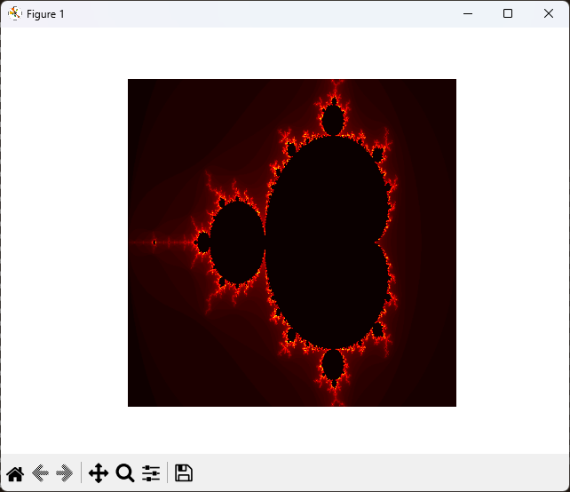

# Fractal_Generator

ce programme est fait en python et as pour but de généré des fractales en fonction des arguments donné.

## exemple

- Enter minimum x: -2
- Enter maximum x: 1
- Enter minimum y: -1
- Enter maximum y: 1
- Enter width: 500
- Enter height: 500
- Enter maximum iterations: 100

