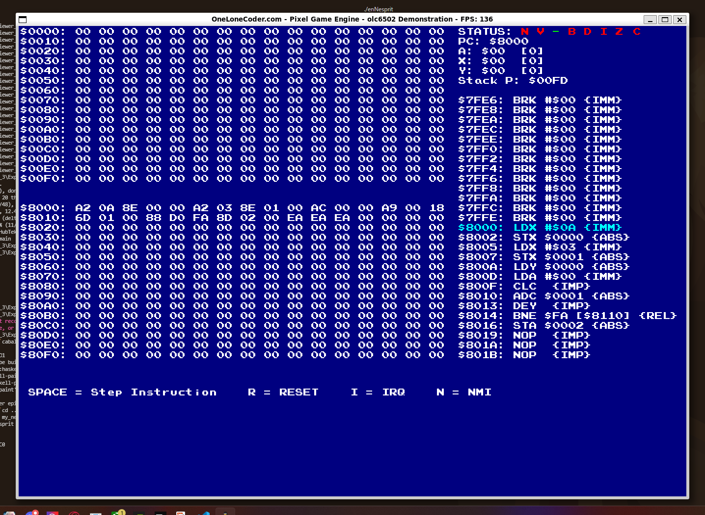
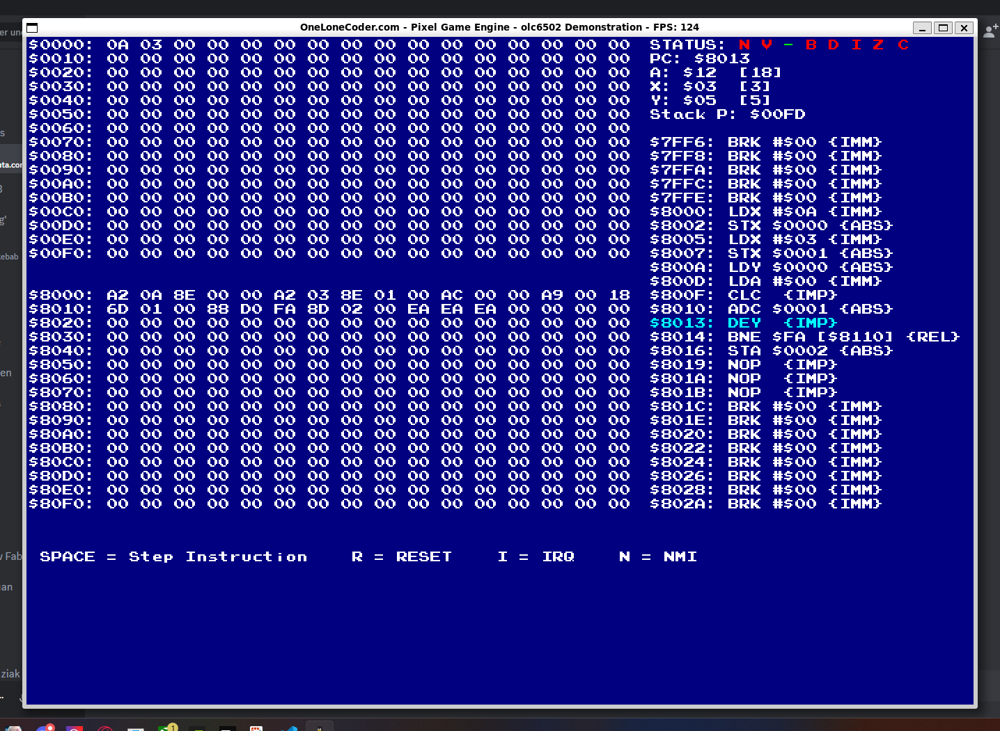
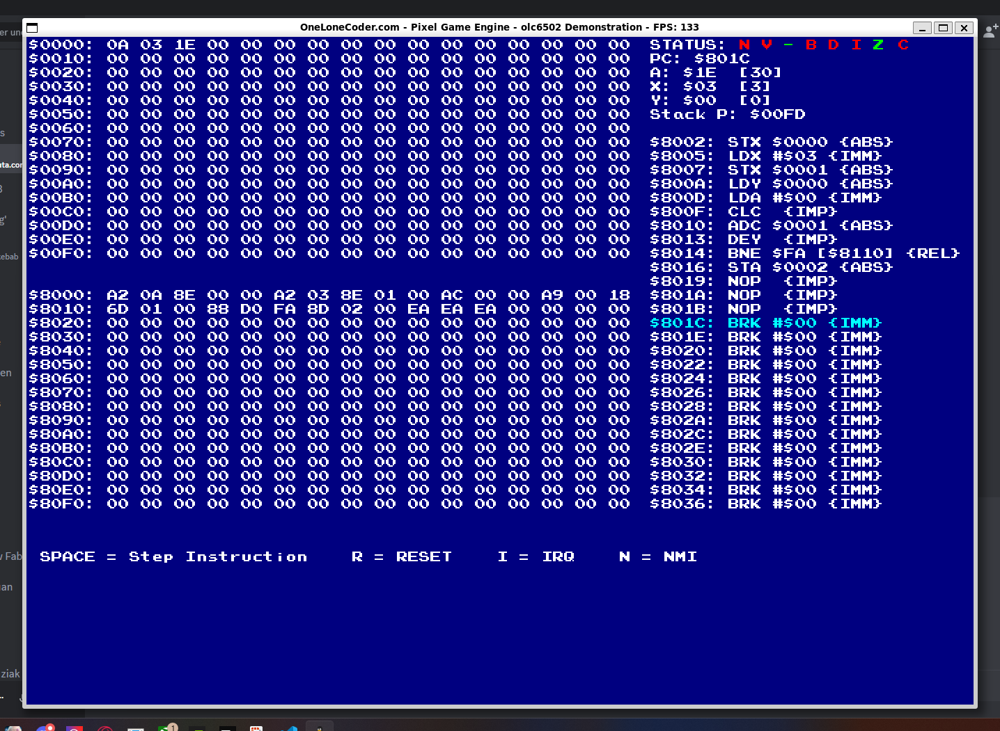

# My_nes

Ce projet consiste a réaliser une nes en c++, pour le moment seul le processeur, la ram et le systeme de stack ont été réaliser. Le programme lors de son excussion ouvre une fenêtre affichant les étapes d'une multiplication de 3 * 10, cela permet de vérifier si les instructions du procésseur ont bien été refaite.

## Photo

### Init

Dans un premier temps nous pouvons voir differentes informations sur la fenêtre:
1. la partie de gauche correspond a la ram
2. la partie supérieure droite montre les registre A, X, Y
3. la partie droite montre les differents instrucions qui vont être effectuer

### En cours

Dans un second temps nous pouvons observer une avancer dans les opérations ainsi que les registres qui ont corectement été incrementer.

### Final

Pour finir, nous pouvons constater que sur le résultat final la multiplication c'est correctement effectuer.