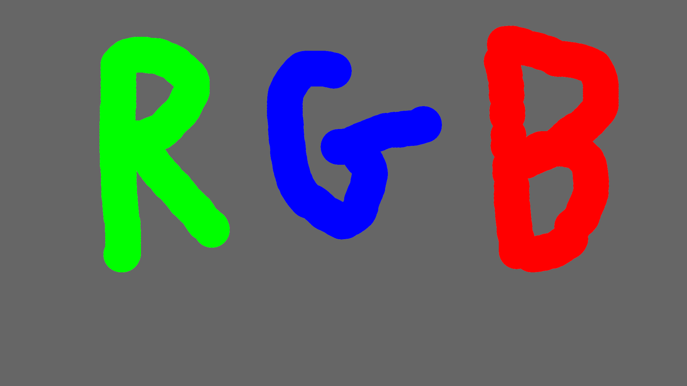

# Rust_Paint

Ce programme as été réaliser dans le but de découvrir la lib bevy en rust, il s'agit d'un pait avec possibilité de changer la couleur du pinceau avec R, G, B et de supprimmer ce qui as été précédement fait avec F. Ce programme as été réaliser avant l'eip afin de découvrir la library et apprendre le rust.

## Photo

