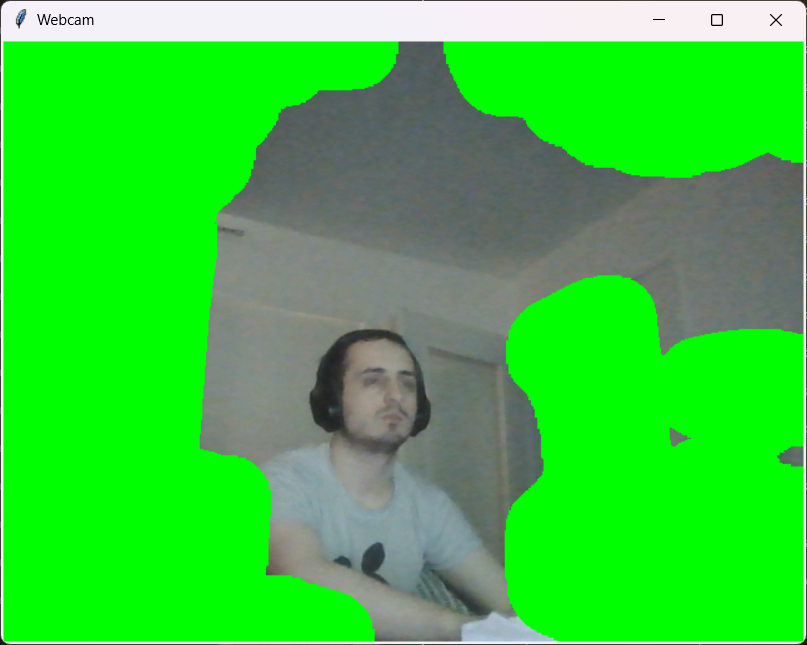
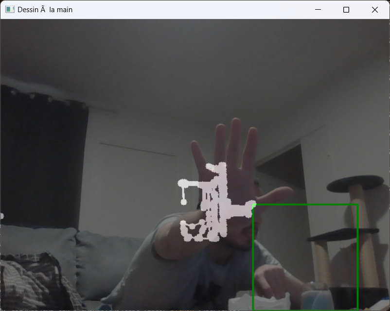

# Tests Webcam

Pour cette experience j'ai voulut réaliser divers tests qui utilisait la webcam.

## Ammélioration camera

J'ai tout d'abord fait test_amelioration_camera.py qui m'as permis de voir comment récupéré l'input de la caméra et intéragir avec en y augmentant le contraste.

## Test mask

Dans un second temps j'ai regarder comment utiliser les mask pour essayer de détecter une personne et pouvoir changer le fond, bien que peu fonctionnel ça m'as permis de découvrir les bases de l'utilisation des mask.

## Test Tracking

Pour finir, j'ai voulut réaliser un systeme de tracking basé sur la main d'une personne, pour se faire j'ai utilisé les fonctionnnalité de mask qui m'ont permis d'isoler la main. Ce programme est peu fonnctionnel mais dans les bonne conditions remplis ça fonction.

