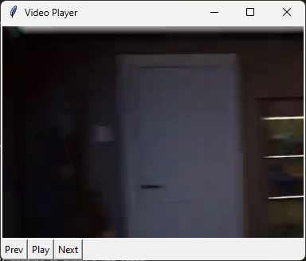

# Video_player

Ce programme comme son nom l'indique permet de lire des videos sous le format mp4. il as été réaliser en python et visait a me faire découvrir comment marcher une vidéo. on peut revenir en arrière ou avancer dans la vidéo à l'aide des flèches du clavier ou du lecteur. On peut égallement mettre en pause le programme avec la barre espace ou le lecteur. Il faut utiliser test2.py pour avoir la version finale.

## Photo

